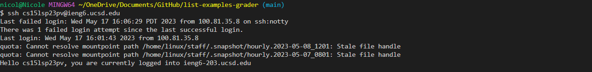
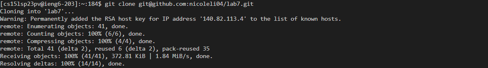
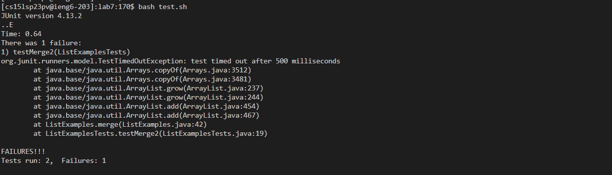
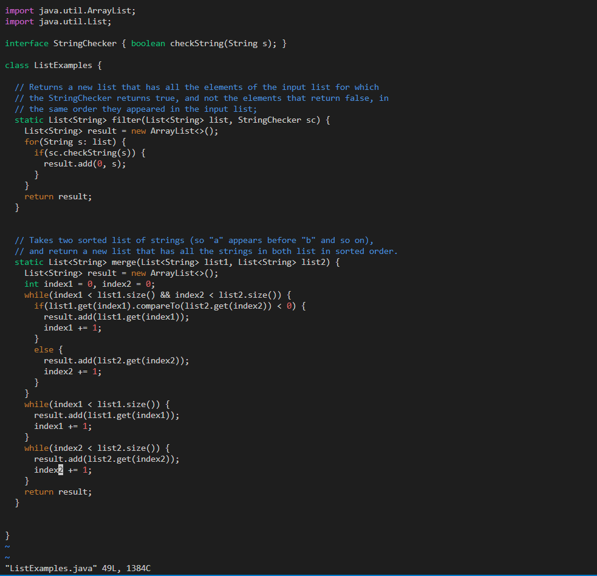
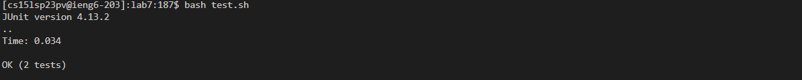
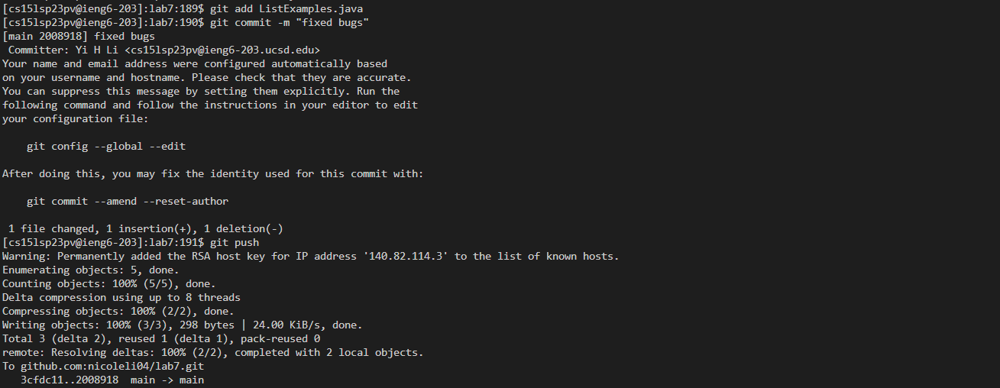

**Lab Report 4**
---
**1. Logging into ieng6**
Keys pressed: `ssh<space>cs15lsp23pv@ucsd.edu<enter>`
To log into ieng6, I had to enter ssh with the account username.

  
**2. Cloning my fork of the repository from your Github account**
Keys pressed:  `git<space>clone<space>git@github.com:nicoleli04/lab7.git<enter>`
I used the `git clone` command to clone the repostiory and used `git@github.com:nicoleli04/lab7.git` as the url of the repository.

**3. Running the tests, demonstrating that they fail**
Keys pressed: `bash<space>test.sh<enter>`
I used bash to run the test.sh file which contains the the java and javac commands to compile and run the code.

**4. Edit the code file to fix the failing test**
Keys pressed: `vim ListExamples.java`
I used vim to access the code in order to make changes to it.

Keys pressed: `42j11lxi2<esc>:wq`
I used 42j to go 42 lines down and 11l to go 11 characters right to get to the item I want to change. Then I use x to delete the 1 and use i to enter insert mode. Once I am in insert mode, I enter 2 to turn it into index2. Then I used <esc> to got back to normal mode, where I entered :wq to save and quit.

  
**5. Run the tests, demonstrating that they now succeed**
Keys pressed: `bash<space>test.sh<enter>`
This is the same as step number 3, except it should now succeed because I fixed the bug in step 4. I used bash to run the test.sh file which contains the the java and javac commands to compile and run the code.

**6. Commit and push the resulting change to your Github account (you can pick any commit message!)**
Keys pressed: `git<space>add<space>ListExamples.java<enter>`
I used git add to add the contents of the file.
Keys pressed: `git<space>commit<space>-m<space>"fixed bugs"<enter>`
I used git commit to commit the changes to my github account with the commit message "fixed bugs".
Keys pressed: `git<space>push<enter>`
I used git push to push the changes on to my github account.

